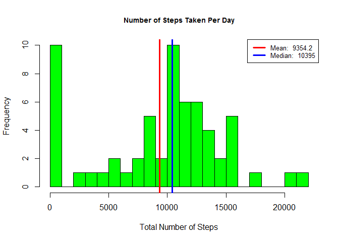
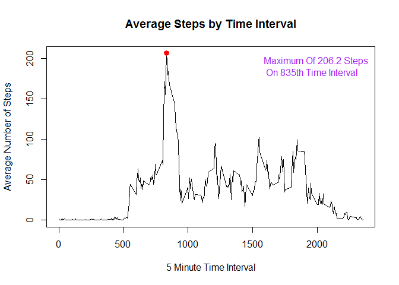
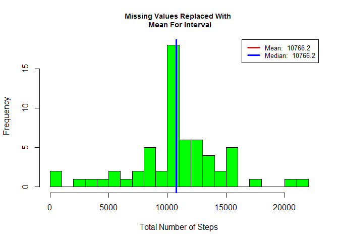

# PA1_template
ssvetoslavova  
July 17, 2015  

Loading and preprocessing the data
---

**Reading data into a dataframe**


```r
dataF = read.csv('activity.csv', header = T)
names(dataF)
```

```
## [1] "steps"    "date"     "interval"
```

```r
str(dataF)
```

```
## 'data.frame':	17568 obs. of  3 variables:
##  $ steps   : int  NA NA NA NA NA NA NA NA NA NA ...
##  $ date    : Factor w/ 61 levels "2012-10-01","2012-10-02",..: 1 1 1 1 1 1 1 1 1 1 ...
##  $ interval: int  0 5 10 15 20 25 30 35 40 45 ...
```

```r
head(dataF)
```

```
##   steps       date interval
## 1    NA 2012-10-01        0
## 2    NA 2012-10-01        5
## 3    NA 2012-10-01       10
## 4    NA 2012-10-01       15
## 5    NA 2012-10-01       20
## 6    NA 2012-10-01       25
```

Displaying mean and average using histogram
---

**Summarizing by day:**


```r
library(data.table)
data_table = data.table(dataF)
data_table_summary = data_table[, list(total_steps = sum(steps, na.rm = T)), 
                          by = date]
```

**Histogram with mean and medium legend:**


```r
histogram = function(x, title){
        hist(x, 
             breaks = 20,
             main = title,
             xlab = 'Total Number of Steps', col = 'green',

             cex.main = .9)

        value_mean = round(mean(x), 1)
        value_median = round(median(x), 1)
        abline(v=value_mean, lwd = 3, col = 'red')
        abline(v=value_median, lwd = 3, col = 'blue')
        legend('topright', lty = 1, lwd = 3, col = c("red", "blue"),
               cex = .8, 
               legend = c(paste('Mean: ', value_mean),
               paste('Median: ', value_median))
               )
}

histogram(data_table_summary$total_steps, 'Number of Steps Taken Per Day')
```

 

Activity pattern - daily average
---

**Visualizing the daily averages of the activity pattern by:**

- *making a time series plot (i.e. type = "l") of the 5-minute interval (x-axis) and the average number of steps taken, averaged across all days (y-axis)*
- *showing which 5-minute interval, on average across all the days in the dataset, contains the maximum number of steps*


```r
data_table_summary_interval = data_table[, list(average_steps = mean(steps, na.rm = T)), 
                          by = interval]
with(data_table_summary_interval, {
        plot(interval, average_steps, type = 'l',
             main = 'Average Steps by Time Interval',
             xlab = '5 Minute Time Interval',
             ylab = 'Average Number of Steps')
        })
maximum_steps = data_table_summary_interval[which.max(average_steps), ]
maximum_lab = paste('Maximum Of ', round(maximum_steps$average_steps, 1), ' Steps \n On ', maximum_steps$interval, 'th Time Interval', sep = '')
points(maximum_steps$interval,  maximum_steps$average_steps, col = 'red', lwd = 3, pch = 19)
legend("topright",
       legend = maximum_lab,
       text.col = 'purple',
       bty = 'n'
       )
```

 

Missing Values
---


```r
sum(is.na(dataF$steps))
```

```
## [1] 2304
```

```r
setkey(data_table, interval)
setkey(data_table_summary_interval, interval)
NA_replace = function(x,y){
        if(is.na(x)){

                return(y)
        }
        return(x)
}
data_table_missing = data_table[data_table_summary_interval]
data_table_missing$new_steps = mapply(NA_replace,data_table_missing$steps, data_table_missing$average_steps)
data_table_summary_missing = data_table_missing[, list(new_steps = sum(new_steps, na.rm = T)), 
                          by = date]
head(data_table_summary_missing)
```

```
##          date new_steps
## 1: 2012-10-01  10766.19
## 2: 2012-10-02    126.00
## 3: 2012-10-03  11352.00
## 4: 2012-10-04  12116.00
## 5: 2012-10-05  13294.00
## 6: 2012-10-06  15420.00
```

***Legend Of Histogram representing mean and median***


```r
histogram(data_table_summary$total_steps, 'Missing Values Removed')
```

 

```r
histogram(data_table_summary_missing$new_steps, 'Missing Values Replaced With \n Mean For Interval')
```

 

***After replacing missing values - the mean and the median are almost the same.***

Are there differences in activity patterns between weekdays and weekends?
---


```r
data_table_missing$date1<-as.Date(data_table_missing$date)
data_table_missing$date2<-weekdays(data_table_missing$date1)
data_table_missing$Day_in_week<-as.factor(ifelse(data_table_missing$date2 %in% c("Saturday","Sunday"), "Weekend", "Weekday"))
data_table_summary_missing = data_table_missing[, list(average_steps = mean(new_steps, na.rm = T)), 
                          by = list(interval, Day_in_week)]
```

**Panel plot representation:**


```r
library(lattice)
```

```
## 
## Attaching package: 'lattice'
## 
## The following object is masked _by_ '.GlobalEnv':
## 
##     histogram
```

```r
xyplot(average_steps~interval | Day_in_week, data = data_table_summary_missing,
      type = 'l',
      xlab = 'Interval',
      ylab = 'Number of Steps',
      layout = c(1,2))
```

 
